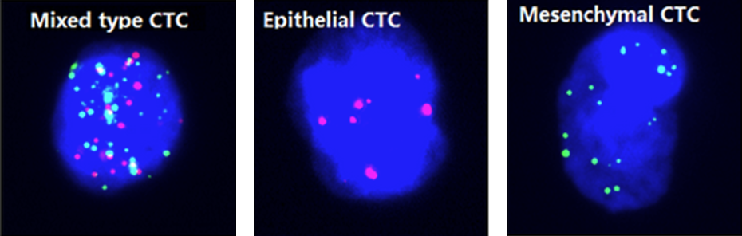

.. include:: <isonum.txt>

**************
Classification
**************

Classification is the process of grouping images into predetermined categories. Classification can be used to discriminate images based on user preference, e.g. different cell types, phenotypes or tissue types etc.

  
  Classification of different types of circulating tumor cells (CTCs) [#ctc]_
  
  
Labelling
=========
To train a neural network for classification it is necessary to create images that are labelled accordingly.

.. figure:: images/classif_tools.png
  :class: shadow-image
  :align: center
  
  Object detection tools
  
Different tools and functions in MIA exist to label images for classification. 

.. include:: ../applications/labelling.rst
  
Tools
-----

As classification only needs a single label for each image, the tools are simpler compared to other applications and you do not have to explicitly click inside the image.

By pressing |assignclass| or :kbd:`F1` currently selected class is assigned to the image.

By pressing |setclass| or :kbd:`F2` currently selected class is assigned to the image and the next image is selected.

.. tip::
  The classification label is shown as a border around the image with the color of the corresponding class
  
Training
========

For details about neural network training see :doc:`../training/index`.
  
Neural Network architectures
----------------------------

For classification there is no extra architecture implemented, meaning that the architecture is identical to the backbone.

.. tip::
  All architectures are implemented without fully connected layers, even if the original architecture had fully connected layers (like vgg-nets).
  

The following backbones are currently supported, untrained or with pretrained weights pre-trained on imagenet dataset [#imn]_:
  
=====================  =======================================================================================================================================  ========
**Model**              **Options**                                                                                                                              **Ref.**
---------------------  ---------------------------------------------------------------------------------------------------------------------------------------  --------
DenseNet               densenet121, densenet169, densenet201                                                                                                    [#dns]_
EfficientNet           efficientnetb0, efficientnetb1, efficientnetb2, efficientnetb3, efficientnetb4, efficientnetb5, efficientnetb6, efficientnetb7           [#eff]_
Inception              inceptionv3, inceptionresnetv2                                                                                                           [#inc]_
MobileNet              mobilenet, mobilenetv2                                                                                                                   [#mob]_
NasNet                 nasnetlarge, nasnetmobile                                                                                                                [#nas]_
ResNet                 resnet18, resnet34, resnet50, resnet101, resnet152, resnet50v2, resnet101v2, resnet152v2                                                 [#res]_
ResNeXt                resnext50, resnext101                                                                                                                    [#rsx]_
SE-ResNet              seresnet18, seresnet34, seresnet50, seresnet101, seresnet152                                                                             [#sen]_
SE-ResNeXt             seresnext50, seresnext101                                                                                                                [#sen]_
SENet                  senet154                                                                                                                                 [#sen]_
VGG	                   vgg16, vgg19                                                                                                                             [#vgg]_
Xception               xception                                                                                                                                 [#xcp]_
=====================  =======================================================================================================================================  ========
  
.. tip::
  * Generally the numbers behind the backbone architecture gives either the number of convolutional layers (e.g. resnet18) or the model version (e.g. inceptionv3). 
  * When you have limited computing recources use a small network architecture or a network optimized for efficiency (e.g. mobilenetv2).
  * From the supported network-backbones the nasnetlarge shows the highest performance on imagenet classification.
  * From the supported network-backbones the mobilenet has the fastest processing time and fewest parameters.
  
Losses and Metrics
------------------ 
 
For classification several objective function have been tested for neural network optimization and directly impact the model training.
Metrics are used to measure the performance of the trained model, but are independent of the optimization and the training process.
The loss and metric functions can be set in  |train| *Train Model* |rarr| |settings| *Settings*.
  
Cross Entropy
~~~~~~~~~~~~~

The cross entropy loss is a widely used objective function used for classification. It is defined as:

.. math::
  L_{CE} = -\sum_{i=1}^{n}{p_i log(q_i)},
  
with :math:`p_i` the true label and :math:`q_i` the model prediction for the :math:`i_{th}` class.

Focal Loss
~~~~~~~~~~

The focal loss is an extension of the cross entropy, which improves performance for unbalanced datasets [#fl]_. It is defined as follows:

.. math::
  L_{FL} = -\sum_{i=1}^{n}{(1-q_i)^\gamma p_i log(q_i)},

with :math:`\gamma` as the focussing parameter. Default is set :math:`\gamma = 2`.
  
Kullback-Leibler Divergence
~~~~~~~~~~~~~~~~~~~~~~~~~~~

The Kullback-Leibler Divergence, sometimes referred as relative entropy, is defined as follows:

.. math::
  L_{KL} = -\sum_{i=1}^{n}{p_i (log(p_i)-log(q_i))}.
  
Accuracy
~~~~~~~~

The pixel accuracy measures all images that are classified correctly:

.. math::
  L_{acc} = \frac{t_p + t_n}{t_p + t_n + f_p + f_n},
  
  
with :math:`t_p` the true positives (:math:`p_i=1` and :math:`q_i=1`), :math:`t_n` the true negatives (:math:`p_i=0` and :math:`q_i=0`), :math:`f_p` the false positives (:math:`p_i=0` and :math:`q_i=1`) and :math:`f_n` the false negatives (:math:`p_i=1` and :math:`q_i=0`). 
The accuracy is a misleading measure for imbalanced data.
  
    
Precision
~~~~~~~~~

The precision measures how many of all predicted positives, actually are positve:

.. math::
  L_{acc} = \frac{t_p}{t_p + f_p}.
  
Recall
~~~~~~

The recall measures how many of the actual positives, are predicted as positve:

.. math::
  L_{acc} = \frac{t_p}{t_p + f_n}.
  
  
F1-Score
~~~~~~~~

The F1-score is a balanced measure of precision and recall

.. math::
  L_{acc} = 2  \frac{precision * recall}{precision + recall}.

  
----------
  
.. [#ctc]
  Dong, J., Zhu, D., Tang, X., Lu, D., Qiu, X., Li, B., Lin, D., Li, L., Liu, J. and Zhou, Q., 2019. Circulating tumor cells in pulmonary vein and peripheral arterial provide a metric for PD-L1 diagnosis and prognosis of patients with non-small cell lung cancer. Plos one, 14(7), p.e0220306.
  
.. [#imn]
  Deng, J., Dong, W., Socher, R., Li, L.J., Li, K. and Fei-Fei, L., 2009, June. Imagenet: A large-scale hierarchical image database. In 2009 IEEE conference on computer vision and pattern recognition (pp. 248-255). Ieee.
  
.. [#dns]  
  Huang, G., Liu, Z., Van Der Maaten, L. and Weinberger, K.Q., 2017. Densely connected convolutional networks. In Proceedings of the IEEE conference on computer vision and pattern recognition (pp. 4700-4708).
  
.. [#eff]
  Tan, M. and Le, Q., 2019, May. Efficientnet: Rethinking model scaling for convolutional neural networks. In International Conference on Machine Learning (pp. 6105-6114). PMLR.
  
.. [#inc]
  Szegedy, C., Vanhoucke, V., Ioffe, S., Shlens, J. and Wojna, Z., 2016. Rethinking the inception architecture for computer vision. In Proceedings of the IEEE conference on computer vision and pattern recognition (pp. 2818-2826).
  
.. [#mob]
  Howard, A.G., Zhu, M., Chen, B., Kalenichenko, D., Wang, W., Weyand, T., Andreetto, M. and Adam, H., 2017. Mobilenets: Efficient convolutional neural networks for mobile vision applications. arXiv preprint arXiv:1704.04861.
  
.. [#nas]
  Zoph, B., Vasudevan, V., Shlens, J. and Le, Q.V., 2018. Learning transferable architectures for scalable image recognition. In Proceedings of the IEEE conference on computer vision and pattern recognition (pp. 8697-8710).  
  
.. [#res]
  He, K., Zhang, X., Ren, S. and Sun, J., 2016. Deep residual learning for image recognition. In Proceedings of the IEEE conference on computer vision and pattern recognition (pp. 770-778).
  
.. [#rsx]  
  Xie, S., Girshick, R., Dollár, P., Tu, Z. and He, K., 2017. Aggregated residual transformations for deep neural networks. In Proceedings of the IEEE conference on computer vision and pattern recognition (pp. 1492-1500).
  
.. [#sen]
  Hu, J., Shen, L. and Sun, G., 2018. Squeeze-and-excitation networks. In Proceedings of the IEEE conference on computer vision and pattern recognition (pp. 7132-7141).
  
.. [#vgg]
  Simonyan, K. and Zisserman, A., 2014. Very deep convolutional networks for large-scale image recognition. arXiv preprint arXiv:1409.1556.
  
.. [#xcp]
  Chollet, F., 2017. Xception: Deep learning with depthwise separable convolutions. In Proceedings of the IEEE conference on computer vision and pattern recognition (pp. 1251-1258).
  
.. [#fl]
  Lin, T.Y., Goyal, P., Girshick, R., He, K. and Dollár, P., 2017. Focal loss for dense object detection. In Proceedings of the IEEE international conference on computer vision (pp. 2980-2988).
 