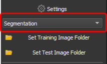
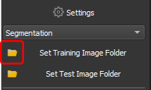
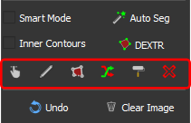
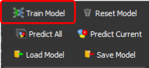
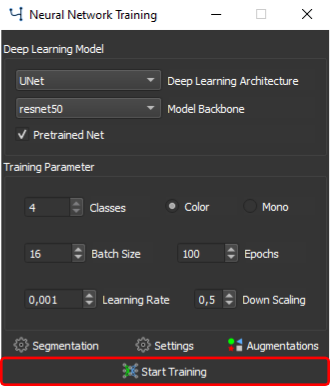
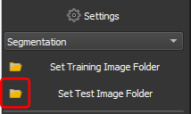
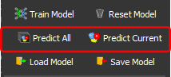

.. include:: ../icons.txt

****************
Quickstart Guide
****************

After starting the software, you will see the MIA user interface. 

.. figure:: images/empty_ui.png
  :class: shadow-image
  :align: center

  MIA user interface
  
Before starting a new project select the :doc:`../applications/index`, that you would like to use with MIA. Note that the application can be changed later and multiple applications can be used with the same dataset.

  Set application
  
For starting a new project you can open and load a folder with training images, that are used for image labeling. To load the training folder, press |load| on the top left. 

  Load training images
  
After loading the training image folder, the first image in the folder is displayed in the :ref:`imageview`.

To label images for neural network training, use the labeling tools.

  Labeling tools for segmentation
  
Navigate through the training folder to label multiple images. When finished labeling a first set of images you can start training a neural network. Open the training window (:doc:`../training/nntraining`).

  open the training window
  
Adjust training settings if necessary and start training.

  Start the training process
  
Depending on the number of training images and your hardware, the training takes several minutes or hours. The process and model performance can be monitored meanwhile in the window that pops up. 

.. figure:: ../training/images/trainplot.png
  :class: shadow-image
  :align: center

  Training monitor
  
If training is finished, open the test images, i. e. the ones you would like to use for :doc:`../prediction/index`.
 

  Open test folder
  
Now you can use the prediction buttons to predict images of the test folder.

  Prediction buttons
  
If the predictions are satisfying for you, congratulations! Otherwise you can add new images to the training data by labeling new images or by correcting predicted images and retrain the model.

