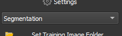

.. include:: ../icons.txt

******************
The User Interface
******************

.. figure:: images/overview.png
  :class: shadow-image
  :align: center
  
  Overview of the MIA user interface, consisting of the Image View, the Control Panel and the Status Bar
  
  
The MIA user interface is divided in 3 areas:

* :ref:`controlpanel`
* :ref:`imageview`
* :ref:`statusbar`

.. _imageview:

The Image View
==============

The Image View is the main interaction for viewing, zooming and labelling the currently displayed image. Whenever you select an image tool (see :ref:`tools`) you can interact with the image depending on the selected tool.
You always have the option to use the drag tool |drag|. By using the drag tool you can use the mouse :kbd:`scroll_wheel` or :kbd:`+` and :kbd:`-` to zoom and press and hold the :kbd:`left_mouse` or :kbd:`arrow_keys` to drag the field of view.

.. tip::
	Whenever you have selected a specific tool, you can press the :kbd:`Spacebar` and the drag tool is selected. When pressing :kbd:`spacebar` again, the previous tool is selected.

.. note::
	The Image View is based on the pixel resolution of the currently loaded image. All displayed labels and numbers are pixel-precise and are not rendered. For images with lower resolution the appearance of the labels might be unsatisfactory but it is important to have an exact control which pixels are labelled.

.. _controlpanel:

The Control Panel
=================

The Control Panel is the main access point to the tools and functions of MIA. In the following the functions in the control panel are described as appearing in the panel from top to bottom. 

Settings
--------
By pressing |settings| **Settings** the settings window is opened to adjust the global settings of MIA (see :doc:`./settings`)

Applications
------------

  
  Choose the application that you want to solve with MIA
  
The first step on every project should be to select the target application. Currently supported are :doc:`../applications/classification`, :doc:`../applications/segmentation` and :doc:`../applications/objectdetection`. 
Every applications has different tools, features and training options.
 

Train and Test Folder 
---------------------
MIA uses 2 different image sets: a training folder and a prediction folder. The training folder is used to label data as input fo the training of the neural network. In the test folder should be the data that you want to predict with the trained model. 
Press the |load| button button to open a folder either for training or testing. Predictions can only performed in the test folder and training will only be performed with data in the training folder. You do not have to set both folders upfront, the folders can be changed at any time.

.. note::
	By default the training folder uses subfolders as additional input for the model training. So folders, e.g. from different experiments, can be combined as training data. In opposite the test folder only uses the top level folder for its prediction. If you want to predict multiple folders, please change the test directory between predictions.

You can switch between training folder by pressing on the corresponding folder path. The currently selected folder is shown in bold.

.. figure:: images/explorer.png
  :class: shadow-image
  :align: center
  
  File explorer for training and test folder
  
After setting the train or test folder an explorer strucure opens below. You can use the explorer to navigate through your image data. When pressing on an image in the explorer, the selected image is displayed in the Image View. Additionally, with the :ref:`navigation` it is possible to navigate through the images ony by one.
  
.. _tools:

Tools
-----

Different tools can be selected to label the current image.

.. figure:: images/tools.png
  :class: shadow-image
  :align: center
  
  Tools for labellung the current image

Whenever you select a tool and pressing with the mouse inside the image view the image is labelled according to the currently selected tool. Each application has its unique tools, see :doc:`../applications/classification`, :doc:`../applications/segmentation` or :doc:`../applications/objectdetection` for details about each tool.
When a tool is selected its name is shown in the :ref:`statusbar`.

Image Buttons
-------------

.. figure:: images/imageButtons.png
  :class: shadow-image
  :align: center
  
  Image Buttons
  
Press the |reset| **Undo** button or :kbd:`ctrl+z` to undo the last drawing action. 

Press the |clear| **Clear Image** button to reset the current image and delete all labels.

Model Buttons
-------------

.. figure:: images/modelButtons.png
  :class: shadow-image
  :align: center
  
  Model Buttons
  
The model buttons offer the interaction for training, prediction, saving, loading a deep learning model.

Press the |train| **Train Model** button to open the training dialog for training a deep learning model (see :doc:`../training/index`).

Press the |clear| **Reset Model** button to delete the currently trained/loaded model. Be sure to save the model if you want reuse the model before resetting.

Press the |predictall| **Predict All** button to predict all images in the test folder or the |predict| button to predict the current image (see :doc:`../prediction/index` for details) with the current model.

Press the |loadmodel| **Load Model** button to load a saved deep learning model.

Press the |savemodel| **Save Model** button to save the currently trained model.

.. note::
	The model training parameter are saved and loaded with the model. Be careful when loading a model and changing model training parameter (such as preprocessing), as the model will likely fail without retraining to predict as training and prediction parameter are no longer matching.

.. _classes:

Classes
-------

.. figure:: images/classes.png
  :class: shadow-image
  :align: center
  
  The Classes Menu
  
The classes menu can be used to edit classes. The different classes are used for separation of different object types. With the :kbd:`+` and :kbd:`-` buttons, classes can be added or removed. By pressing the button left to the class or buttons :kbd:`0-9` that class is selected as the currently active class. Whenever a structure is labelled, it will get the label of the currently active class. 
By pressing the color of the class, a color menu is shown to edit the class color. By pressing in the name of the class, its name can be changed. The number to the right of the class name indicates the number of objects of this class.

Results and Posprocessing
-------------------------

.. figure:: images/resultspostprocessing.png
  :class: shadow-image
  :align: center
  
  Results and Postprocessing
  
By pressing the |postprocessing| **Postprocessing** button the postprocessing window is opened (see :doc:`../postprocessing/index`).

Press the |results| **Results** button to open the results window (see :doc:`../results/index`).

Brightness and Contrast
-----------------------

.. figure:: images/brightnesscontrast.png
  :class: shadow-image
  :align: center
  
  Brightness and Contrast Slider
  
By changing the **Brightness** and **Contrast** sliders, the brightness or contrast of the currently displayed image is changed, accordingly. The effect happens after releasing the button. When the next image is selected, brightness and contrast are reset.

.. _navigation:

Image Navigation
----------------

.. figure:: images/imagenavigation.png
  :class: shadow-image
  :align: center
  
  Previous and Next Image
  
Pressing the |previous| or |next| button displays the previous or next image of the current folder in the Image View.

.. _statusbar:

The Status Bar
==============
In the status bar you find important information of the current progress and status of the MIA software.

.. figure:: images/statusbar.png
  :class: shadow-image
  :align: center
  
  The Status Bar is divided in three parts: the current image, the progress bar and the status message
  
On the left part of the status bar is shown the **current image** and the number of images that are in the current selected folder. Whenever a longer calculation is performed a **progress bar** is shown that shows the progress of the calculation. The **status message** shows imaportant messages such as the currently selected tool or when a process is finished.
